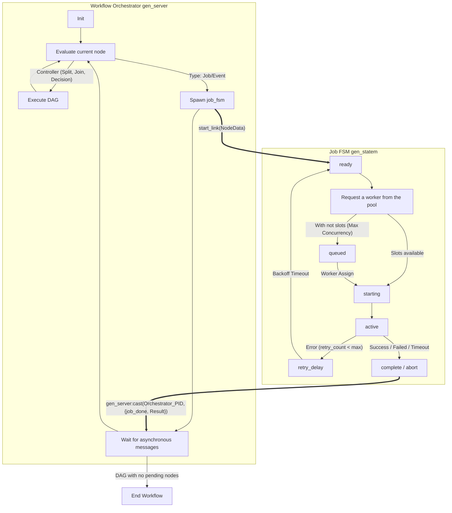

stellar_core
=====


Build
-----
```bash
$ rebar3 compile
```


```mermaid
flowchart TD
    subgraph DAG_Orchestrator[Workflow Orchestrator gen_server]
        W_Start[Init] --> W_Eval[Evaluate current node]
        W_Eval -- "Controller (Split, Join, Decision)" --> W_Logic[Execute DAG]
        W_Logic --> W_Eval
        W_Eval -- "Type: Job/Event" --> W_Spawn[Spawn job_fsm]
        W_Wait[Wait for asynchronous messages]
        W_Spawn --> W_Wait
    end

    subgraph Job_State_Machine[Job FSM gen_statem]
        J_Ready[ready] --> J_Req[Request a worker from the pool]
        J_Req -- "With not slots (Max Concurrency)" --> J_Queued[queued]
        J_Req -- "Slots available" --> J_Starting[starting]
        J_Queued -- "Worker Assign" --> J_Starting
        J_Starting --> J_Active[active]
        J_Active -- "Error (retry_count < max)" --> J_Retry[retry_delay]
        J_Retry -- "Backoff Timeout" --> J_Ready
        J_Active -- "Success / Failed / Timeout" --> J_Term[complete / abort]
    end

    W_Spawn == "start_link(NodeData)" ===> J_Ready
    J_Term == "gen_server:cast(Orchestrator_PID, {job_done, Result})" ===> W_Wait
    W_Wait --> W_Eval
    W_Wait -- "DAG with no pending nodes" --> W_End[End Workflow]
```
